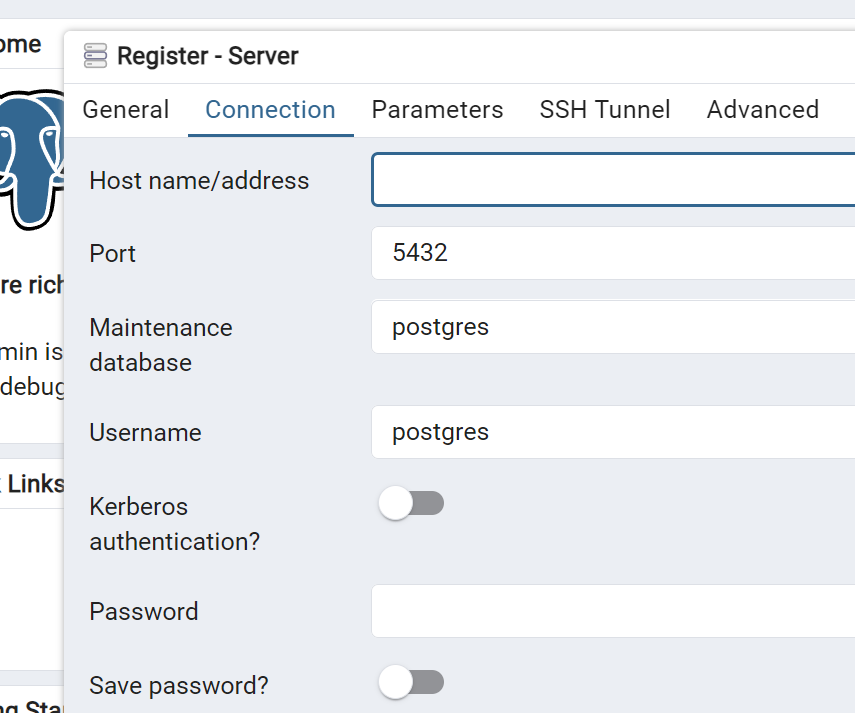

# bootkek (Muctr Granite?)

## Запуск серверов

### Backend:

Установка зависимостей:

```shell
python -m venv venv
venv/Scripts/activate
pip install -r requirements.txt
```

После **запускайте** `main.py` (если через Pycharm - все будет норм)

Открыть Swagger - http://127.0.0.1:8000/docs

### Frontend

```shell
# Скачивание зависимостей
npm install
# Запуск сервера
npm run dev
```

## Конфигурация

Создаем файл переменных окружения `.env` (ориентируясь на `.env.example`)

По мере развития проекта, будут добавляться другие параметры, как например JWT Токены, возможно Redis и так далее. Так
что не забывайте проверять этот файл.

### БД (PostgreSQL)

```text
# DSN для подключения к PostgreSQL
DB_URL = postgresql+asyncpg://{user}:{pass}@{host}:{port}/{name}
# Ручка для включения / выключения логов к бд (bool)
DB_ECHO = 0
```

**GUI для Postgres**: [pgAdmin](https://www.pgadmin.org/download/)

Все параметры в DSN определяются непосредственно при создании базы


*Username - `user`

*Maintenance database - `name`

___

Для подключения к базе необходимо создать сервер в pgAdmin, и использовать введенные значения для `.env`
(история с `docker-compose.yml` будет развиваться чуть позже)

### JWT

В разработке пупупу


